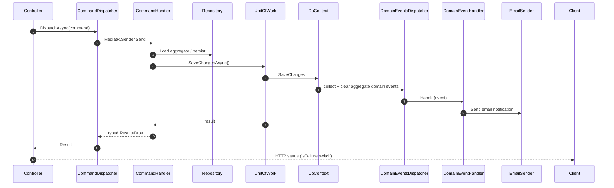
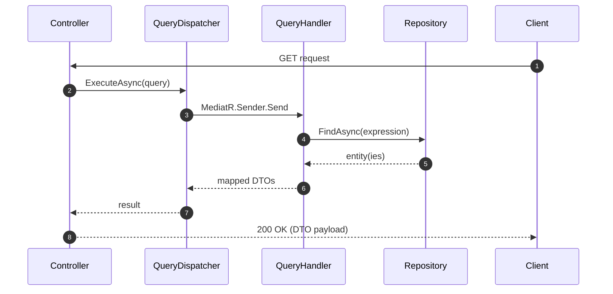

# Ticket Reservation System

A **.NET social event ticket purchase API** built as a portfolio project to demonstrate proficiency with application architecture. The system is an end‑to‑end ticket reservation pipeline: users register with a passwordless email code, browse `SocialEvents` and their `Tickets`, reserve a ticket and pay for it through a **Stripe** Checkout session.

> [!IMPORTANT]
> This is a **portfolio / demonstration project**, not a production application. It intentionally focuses on architecture quality — clean layering, DDD, CQRS, and tested business rules. Persistence runs on **EF Core InMemory** (no migrations) and external services use placeholder credentials.

---

## Table of Contents

- [About the Project](#about-the-project)
- [Used Services & Infrastructure](#used-services--infrastructure)
- [Used Patterns](#used-patterns)
- [Endpoints](#endpoints)
- [Request & Query Flow Architecture](#request--query-flow-architecture)
- [Project Structure](#project-structure)
- [How to Run](#how-to-run)
- [Testing](#testing)

---

## About the Project

### Purpose

The API lets a user walk the full purchase journey for a social event ticket:

1. **Create an account** (name, phone, email).
2. **Authenticate** passwordless — the user requests a single‑use 6‑digit code sent by email and exchanges it for a JWT.
3. **Browse events and tickets**.
4. **Reserve a ticket** (locked for a limited time while paying).
5. **Pay** through a Stripe Checkout session.
6. **Confirm the purchase** when Stripe reports the payment completed via a signed webhook.

### Problems solved

| Problem | How it is solved |
|---|---|
| **Concurrency** | Optimistic concurrency — the `Ticket` aggregate carries a row‑version `Version` token (`ApplicationDbContext` config), so two users cannot double‑reserve the same seat. Background jobs catch `DbUpdateConcurrencyException` and skip gracefully. |
| **Authentication** | Passwordless flow — `VerificationCode` aggregate generates a single‑use email code; a JWT (HS256, `sub`/`email`/`jti` claims) is issued on a correct exchange. Code sending is rate‑limited (HTTP 429) and codes expire. |
| **Authorization** | `[Authorize]` on protected routes plus a **self‑only** data rule — controllers compare the authenticated `sub` claim (`ClaimsExtensions.TryGetUserId`) against the requested resource and return 401 on mismatch. |
| **Notifications** | Domain events (`TicketReservedEvent`, `TicketConfirmedEvent`, `PaymentCompletedEvent`, …) are dispatched on `SaveChanges` and subscribed by email handlers that send MimeKit/SMTP messages on a background scope. |
| **Payments** | Stripe Checkout session creation with per‑currency minor‑unit handling; a signed webhook (`EventUtility.ConstructEvent`) drives the `Payment` state machine (`Pending → Completed/Failed/Expired`) without trusting the client. |
| **Reservation lifecycle** | A `Ticket` state machine (`Available → Reserved → Confirmed`) enforces that only a reserved ticket can be checked out. A Quartz job releases stale `Reserved` tickets (> 10 min) and another expires abandoned payments (> 24 h), releasing the ticket again. |
| **Error handling** | Operations return `Result`-typed values with strongly typed `Error` records; controllers map each error to the correct HTTP status. Unexpected exceptions are funneled through a single `ExceptionHandlingMiddleware` into `ProblemDetails`. |

---

## Used Services & Infrastructure

- **EF Core 10** (`Microsoft.EntityFrameworkCore.InMemory`, 10.0.10)
  - Value converters turn the strongly typed IDs into `Guid` columns and **serialize value objects (`Money`, `DateTimeRange`) as JSON strings**.
  - Enums persisted as strings, concurrency token (`byte[]` row version) on `Ticket`, unique email index, composite `(UserId, Code)` index for verification codes.
- **Email service** — `IEmailSender` port (`Application/Abstractions`) implemented by `MimeKitEmailSender` (SMTP with STARTTLS), configured through the `Smtp` appsettings section (Brevo host/port 587).
- **Background services** — two **Quartz** hosted jobs (`[DisallowConcurrentExecution]`, scoped `IServiceScopeFactory`):
  - `ExpiredReservationsCleanupJob` — every 10 min, releases `Reserved` tickets older than 10 min.
  - `ExpiredPaymentsCleanupJob` — every 1 h, expires `Pending` payments older than 24 h and releases their tickets.
- **Stripe payment gateway** (`Stripe.net`) — creates Checkout Sessions and exposes a webhook endpoint that verifies the `Stripe-Signature` header before processing the payload.
- **JWT Bearer auth** (`Microsoft.AspNetCore.Authentication.JwtBearer`) — HS256, issuer/audience/lifetime/signing-key validation; `JwtSettings` from appsettings.
- **MediatR 14** — CQRS plumbing behind typed dispatchers.
- **API documentation** — ASP.NET Core OpenAPI plus **Scalar** UI (`/scalar`).

---

## Used Patterns

```
                 ┌──────────────────────────────┐
                 │            API               │  Controllers, middleware, JWT wiring
                 └──────────────┬───────────────┘
                                │  commands / queries / results
                 ┌──────────────▼───────────────┐
                 │         APPLICATION          │  CQRS handlers, DTOs, errors,
                 │  (depends on Domain, never   │  domain event handlers, service interfaces
                 │        on Infrastructure)    │
                 └──────────────┬───────────────┘
                                │  aggregates, events, interfaces
                 ┌──────────────▼───────────────┐
                 │           DOMAIN             │  pure model, no dependencies
                 └──────────────▲───────────────┘
                                │  implements interfaces / repositories
                 ┌──────────────┴───────────────┐
                 │       INFRASTRUCTURE         │  EF Core, SMTP, Stripe, Quartz
                 └──────────────────────────────┘
```

**Dependency flow is one-directional** — `API → Application → Domain`, with `Infrastructure` depending on `Domain` (implementing its interfaces) and being registered from the composition root (`Program.cs`). Nothing points back up.

- **DDD + Clean Architecture** — aggregates (`Ticket`, `User`, `SocialEvent`, `Payment`, `VerificationCode`) own their business rules and invariants; value objects (`Money`, `DateTimeRange`) enforce their own validation.
- **CQRS** — commands and queries separated, each dispatched through a typed `CommandDispatcher` / `QueryDispatcher` to a MediatR handler.
- **Repository** — `IEventRepository`, `ITicketRepository`, `IUserRepository`, `IPaymentRepository`, `IVerificationCodeRepository` interfaces in `Domain`; EF Core implementations in `Infrastructure`.
- **Unit of Work** — `IUnitOfWork` exposes all repositories and `SaveChanges`; one UoW per request scope.
- **Domain events** — aggregates raise events (`UserRegisteredEvent`, `TicketReservedEvent`, `PaymentCompletedEvent`, …); `ApplicationDbContext` collects and dispatches them on `SaveChanges` through `DomainEventsDispatcher` to registered handlers (outbox‑style, pre‑save).
- **Result pattern** — `Result` / `Result<T>` with abstract `Error` records; handlers return typed results (e.g. `TicketReservationResult : Result<Dto>`), controllers do a single `IsFailure` switch and map to HTTP status.
- **Strongly typed IDs** — `UserId`, `TicketId`, `SocialEventId`, `PaymentId`, `VerificationCodeId` as `record struct` types (`Guid` backing), mapped to columns via EF value converters.
- **Bonus patterns you will find**: aggregate **state machines** (`TicketStatus`, `PaymentStatus`, `EventStatus`), **value objects**, **domain exceptions/invariant enforcement**, **optimistic concurrency**, command‑scoped event dispatch, Dependency Injection, and behavioral handler/controller tests.

---

## Endpoints

All routes are under `https://localhost:<port>` (development). 🔒 = requires a JWT bearer token.

| Method | Route | Description |
|---|---|---|
| `POST` | `api/authentication/send-code` | Requests an authentication code for a known email address; when valid, the user receives an email with a single‑use 6‑digit code (rate‑limited, 429). |
| `POST` | `api/authentication/token` | Exchanges email + code for a JWT access token (401 on invalid/expired code). |
| `POST` | `api/user` | Registers a new user (validate email/passwordless-ready account) returns the new user. |
| `GET` | `api/user/{userId}` 🔒 | Returns the authenticated user's profile (self‑only; 401 for other users). |
| `GET` | `api/events` | Lists all social events. |
| `GET` | `api/events/{eventId}` | Returns a single event or 404. |
| `GET` | `api/tickets/{ticketId}` | Returns a single ticket (public). |
| `GET` | `api/tickets/{eventId}/tickets` | Lists all tickets of an event (public). |
| `POST` | `api/tickets/{ticketId}/reserve` 🔒 | Reserves a ticket for the authenticated user (state `Available → Reserved`). |
| `POST` | `api/tickets/{ticketId}/cancel` 🔒 | Cancels the user's reservation (state `Reserved → Available`). |
| `POST` | `api/payments/checkout` 🔒 | Creates a Stripe Checkout session for a reserved ticket and returns the checkout URL. |
| `POST` | `webhooks/stripe` | Stripe webhook handler; verifies the signature and applies `checkout.session.completed` / payment outcomes to the internal state. |

---

## Request & Query Flow Architecture

### Command flow (write path)



### Query flow (read path)



---

## Project Structure

```
TicketReservationSystem.slnx
├─ TicketReservationSystem/                 net10.0 web project
│  ├─ Program.cs                            composition root (auth, DI, pipeline)
│  ├─ appsettings.json                      Jwt / Smtp / Stripe settings
│  ├─ API/
│  │  ├─ Controllers/                       Authentication, User, Events,
│  │  │                                     Tickets, Payments, Webhooks
│  │  ├─ Middleware/ExceptionHandlingMiddleware.cs
│  │  └─ ClaimsExtensions.cs                JWT sub → UserId
│  ├─ Application/                          CQRS layer (depends only on Domain)
│  │  ├─ Abstractions/                      Result, Error, ICommandDispatcher,
│  │  │                                     IQueryDispatcher, service ports
│  │  ├─ Commands/                          feature commands + handlers (MediatR)
│  │  ├─ Queries/                           feature queries + handlers
│  │  ├─ DomainEventHandlers/               email subscription handlers
│  │  ├─ Authentication/                    JwtService
│  │  ├─ DTOs/  Errors/  Requests/
│  │  └─ DependencyInjection.cs
│  ├─ Domain/                               pure model, no dependencies
│  │  ├─ Entities/                          Ticket, User, SocialEvent,
│  │  │                                     Payment, VerificationCode
│  │  ├─ Events/                            domain event records
│  │  ├─ Ids/                               strongly typed IDs
│  │  ├─ ValueObjects/                      Money, DateTimeRange
│  │  ├─ Repositories/                      repository port interfaces
│  │  ├─ Exceptions/  Primitives/           entity/aggregate bases
│  └─ Infrastructure/
│     ├─ Persistence/ApplicationDbContext.cs + value converters
│     ├─ Repository/                        EF Core repo impls + UnitOfWork
│     ├─ DomainEventsDispatcher/            event dispatch on SaveChanges
│     ├─ Services/
│     │  ├─ Email/                          MimeKitEmailSender
│     │  ├─ Payments/                       StripePaymentsService
│     │  ├─ Jobs/                           Quartz cleanup jobs
│     │  └─ InMemory/                       InMemorySeeder (startup seed data)
│     └─ DependencyInjection.cs
└─ TicketReservationSystem.Tests/           xUnit tests (209 [Fact])
```

---

## How to Run

**Prerequisites**

- .NET 10 SDK
- (Optional) a Stripe test secret + webhook secret, and SMTP credentials

**Configuration**

Set the placeholders in `TicketReservationSystem/appsettings.json`:

```jsonc
{
"Jwt": {
  "Key": "replace_with_your_security_key_replace_with_your_security_key",
},
"Smtp": {
  "Host": "replace_with_smtp_provider_host_address",
  "Port": 587,
  "Username": "replace_with_smtp_provider_username",
  "Password": "replace_with_smtp_provider_password",
  "FromEmail": "replace_with_your_email_address",
  "FromName": "Ticket reservation system"
},
"Stripe": {
  "SecretKey": "sk_test_replace_me",
  "WebhookSecret": "whsec_replace_me",
  "SuccessUrl": "replace_with_your_success_url",
  "CancelUrl": "replace_with_your_cancel_url",
  "Currency": "PLN"
}
}
```

**Run**

```bash
dotnet run --project TicketReservationSystem
```

On startup the `InMemorySeeder` seeds events and tickets into the in‑memory database, so there is always demo data to browse and reserve.

Interactive API docs are served at **`/scalar`** (Scalar UI) and **`/openapi/v1.json`** (OpenAPI JSON) in development.

---

## Testing

209 xUnit tests in 40 files cover the behavior-driven layers touched by the architecture:

- **Controllers** — HTTP status mapping from `Result` failures (Authentication, User, Events, Tickets, Payments, Webhooks).
- **Command handlers** — add user, authentication code flow, token generation, ticket reserve/cancel, Stripe checkout and webhook processing.
- **Query handlers** — event, ticket and user read handlers mapping entities to DTOs (found / not-found / empty paths).
- **CQRS plumbing & services** — `CommandDispatcher` / `QueryDispatcher` MediatR forwarding, `JwtService` token round-trip (claims, issuer, audience, expiry), `Result` invariant.
- **Domain aggregates** — ticket reservation/confirmation/state machine, payment lifecycle, invariant guards.
- **Domain event handlers** — email sent on registration, reservation, confirmation, cancellation, and payment outcomes.
- **Background jobs** — expired-reservation and expired-payment cleanup with concurrency handling.
- **Infrastructure** — EF value‑converter round‑trips (IDs, `Money`, `DateTimeRange`), middleware error wrapping, claim extensions.

Run them with:

```bash
dotnet test
```

---

## Highlighted Touches

- Controllers are thin — they only parse input, dispatch, and translate `Result` errors to HTTP.
- Business rules live in the `Domain` aggregate methods behind expressive names (`Ticket.Reserve()`, `SocialEvent.ReserveTicket()`, `VerificationCode.Generate()`), enforced against state‑machine transitions.
- `Money` is a first‑class value object with currency awareness — Stripe amounts are built from minor‑unit divisors per currency, and a currency mismatch is a typed domain error.
- Domain events are the integration seam: reservation, confirmation, cancellation and payment events fan out to email notifications without coupling `Domain` to any email implementation.